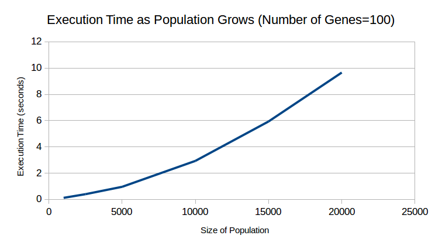
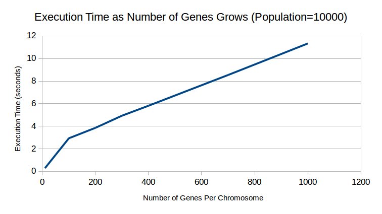

## Parallelizing Genetic Algorithms Project Checkpoint
### Raymond Chee

### Updates:
We implemented a sequential version of a genetic algorithm which maximizes the total fitness of an array of chromosomes. Chromosomes are defined as an array of genes, which are 0-1 values. During crossover, children chromosomes for the next generation are defined as a random mixture of two randomly chosen parents’ genes, and there is a 5% chance for each of the child’s genes to be flipped. We also added some code to time this process.

I also began implementing a parallel version of this code in CUDA, but unfortunately there are still some bugs I need to fix, so I don’t have any measurements for that. The parallelization approach I plan to use is to currently just parallelize the fitness evaluation loop, which should be trivial since no member of the population affects the fitness of another with the current fitness function. More thought needs to be put into extracting parallelization from the crossover step, since the algorithm to randomly choose parents to cross over based on the weighted probability of the chromosome’s fitness is very sequential right now.

### New schedule:
* November 19-21: Fix bugs in CUDA code.
* November 22-25: Figure out and implement ways to parallelize the crossover
* November 26-29: Explore variations on the sequential genetic algorithm using different genetic operators and convergence tests
* November 30-December 2: Write sequential versions of the variations
* December 3-5: Parallelize these variations:
* December 6-9: Find an interesting fitness function/real world example for the genetic algorithm and implement/parallelize that
* December 10-13: Write a version of the genetic algorithm using another framework, or if I’m behind schedule, catch up
* December 14-16: Compile graphs and make the poster

### Goals:
* Produce graphs which convey how much parallelism can be achieved with different approaches to implementing genetic algorithms
* Parallelize a useful application of genetic algorithms and show speedups.
* Compare the speedups between CUDA and another framework (nice to have)

### Preliminary results:
Ideally, these graphs would have the an extra line showing the performance of a CUDA implementation, but I couldn’t fix the bugs in time. These graphs would show how changing the two parameters to the fitness function affects execution time for both sequential and parallel implementations. For serial, it’s clearly linear, but it would probably be more interesting for the parallel version.

