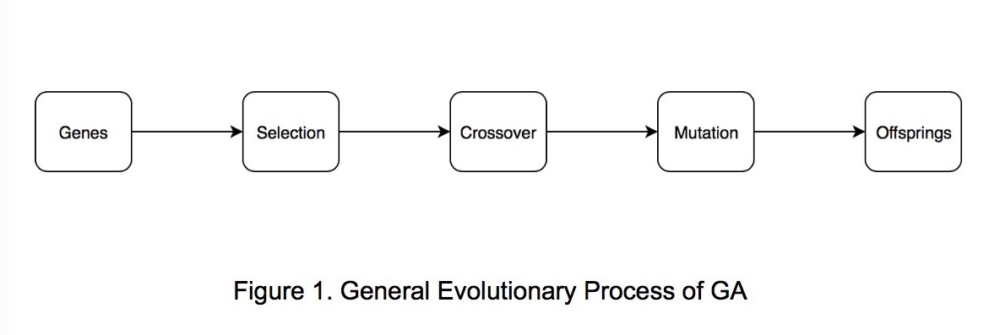

## Parallelizing Genetic Algorithms on GPU
### _By Shihao, Raymond_

### SUMMARY
We are going to implement parallelized genetic algorithms on NVIDIA GeForce 1080 GPU on GHC machines.

### BACKGROUND
Genetic Algorithms (GAs) are widely used in many applications and are often times computationally expensive. Although GAs are typically done in an iterative way, the computation within each generation is inherently parallel (Figure 1).

This pipelined process is very similar to graphics pipeline on GPU and might benefit a lot from parallelism. So we decide to implement the evolutionary process in parallel, with different genetic operators and using different programming models.

### CHALLENGES
If the fitness function’s evaluation time is dependent on the input genes, there could be a workload imbalance between threads which could reduce the speedup from parallelizing the algorithm. One of the challenges would be to achieve a high speedup when the fitness function has a variable execution time. We would need to come up with a way to maintain the quality of the genetic algorithm’s results and keep a reasonable convergence rate in our parallelization. Additionally, one of the computations in genetic algorithms is to sort the results of the fitness functions applied to the set of genes in an iteration, and we would need to implement a parallel sorting algorithm in this context.

### RESOURCES
* We’ll start with implementing multiple sequential versions of GA from scratch
* Introduction to Machine Learning, Tom M. Mitchell
* Research papers in related field (will be cited as the project goes)
* Machines with GPUs to run our parallelized versions of the algorithm.

### GOALS AND DELIVERABLES
Plan to achieve:
* Implement multiple sequential versions of a genetic algorithm using different genetic operators, evaluating tradeoffs in quality and convergence rate for some fixed fitness functions.
* Try to parallelize the different sequential versions of GA, on GPU first.
* Test a specific application of a GA and explore how to improve performance as much as possible on the application (may parallelize the fitness function itself)
* In the demo, show graphs of the quality and performance of the different parallelized versions of the GAs versus their sequential versions.

Hope to achieve:
* Try to implement GAs on other parallel models/abstractions like ISPC or MPI, and benchmarking these frameworks to compare with the GPU version.

### PLATFORM CHOICE
We will implement GAs in C/CUDA on NVIDIA 1080 GPU on GHC machines. As mentioned above, the evolutionary process is quite similar to graphics processing so GPU may be the most intuitive way to implement it. Other parallel models are also possible after we implemented the GPU version.

### SCHEDULE
* November 5-11: choose a few fitness functions to test on and implement a sequential genetic algorithm using these fitness functions.
* November 12-18: Parallelize the genetic algorithm with CUDA. Have some preliminary results by the intermediate checkpoint of the speedups from the parallel algorithm as well as the quality of the genetic algorithm’s results
* November 19-25: Explore variations on the sequential genetic algorithm using different genetic operators and convergence tests
* November 26 - December 2: Parallelize the variations of the genetic algorithm.
* December 3-9: Explore a specific fitness function which can be parallelized and evaluate the performance of the GAs when the fitness function is sequential or parallelized.
* December 10-16: Put together the poster and explore other frameworks if time allows.
